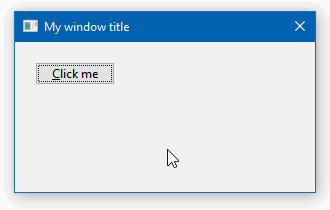

# WinSafe

[](https://crates.io/crates/winsafe)
[](https://docs.rs/winsafe)
[](https://github.com/rodrigocfd/winsafe)
[](https://github.com/rodrigocfd/winsafe)

This crate provides bindings for a selected subset of the [Win32 API](https://docs.microsoft.com/en-us/windows/win32/) in safe, idiomatic Rust. This subset includes functions, structs and constants. In addition, it provides high-level [GUI wrappers](crate::gui) for windows and controls, allowing the development of complex and scalable Win32 GUI applications, in 100% native Win32.

Documentation for the `master` branch: [rodrigocfd.github.io/winsafe/winsafe](https://rodrigocfd.github.io/winsafe/winsafe/)

## Current status

This crate is still in its infancy! 👶

It already works, but it's still incomplete and under heavy development.

## Example

WinSafe works with both ordinary windows (created programatically) and resource dialogs (from `.rc` files). Be sure to check the [examples folder](examples/), which is being constantly updated.

Here is an [example](examples/01_button_click/) of an ordinary window with a button. Note how the click event is handled with a closure:



```rust
#![windows_subsystem = "windows"]

use winsafe::gui;
use winsafe::{POINT, SIZE, WinResult};

fn main() {
    let my_window = MyWindow::new();  // instantiate our main window
    if let Err(e) = my_window.run() { // ... and run it
        eprintln!("{}", e);
    }
}


#[derive(Clone)]
pub struct MyWindow {
    wnd:       gui::CustomMain, // responsible for managing the window
    btn_hello: gui::Button,     // a button
}

impl MyWindow {
    pub fn new() -> MyWindow {
        let wnd = gui::CustomMain::new( // instantiate the window manager
            gui::CustomMainOpts {
                title: "My window title".to_owned(),
                size: SIZE::new(300, 150),
                ..Default::default() // leave all other options as default
            },
        );

        let btn_hello = gui::Button::new(
            &wnd, // the window manager is the parent of our button
            gui::ButtonOpts {
                text: "&Click me".to_owned(),
                position: POINT::new(20, 20),
                ..Default::default()
            },
        );

        let new_self = Self { wnd, btn_hello };
        new_self.events(); // attach our events
        new_self
    }

    pub fn run(&self) -> WinResult<()> {
        self.wnd.run_main(None) // simply let the window manager do the hard work
    }

    fn events(&self) {
        let wnd = self.wnd.clone(); // clone so it can be passed into the closure

        self.btn_hello.on().bn_clicked(move || {
            wnd.hwnd().SetWindowText("Hello, world!").unwrap();
        });
    }
}
```

## License

Licensed under [MIT license](https://opensource.org/licenses/MIT), see [LICENSE.txt](LICENSE.txt) for details.
